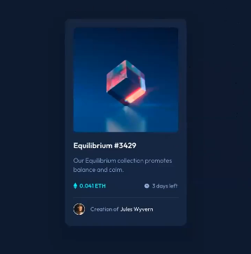
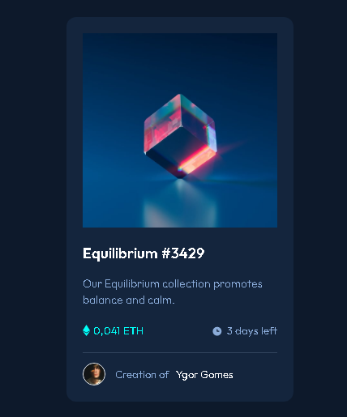
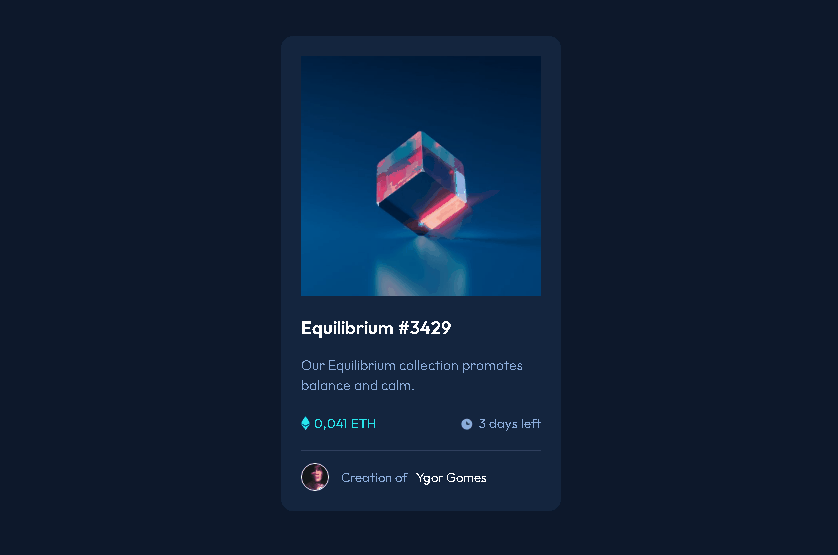

# 1° Projeto do Front-end Mentor 😊

 

##  NFT Card - Front-End Mentor

---

 
 

# DIFICULDADES DURANTE O PROJETO 😓

 Todo novo desafio gera aquele frio na barriga, e nesse não foi diferente. Por se tratar do meu primeiro projeto como teste, feito sozinho, tinha receios comigo, receios de não conseguir, de travar no meio do projeto e etc.

 

Porém, acredito que tenha conseguido deixar bastante parecido com a imagem do projeto original

 

A maior dificuldade que tive foi na questão de fazer a parte de estilização do before e after, por algum motivo me esqueci de usar o "position:relative" no pai do elemento, enquanto ele era um absolute, e por conta disso passei longos 40 minutos revisando anotações e o código até entender aonde eu errei. Erro de inciante junto com o nervosismo...

 

# TECNOLOGIAS USADAS 🛠

 

-   # HTML

-   # CSS
 

# RESULTADO FINAL ✨

 

## Imagem do projeto original 👇

---

 

 
 

## Imagem do projeto desenvolvido 👇

---

 

 
 

## Hover com Before e After 🎨

---

 

Fiquei bem feliz com o resultado alcançado e por saber que estou evoluindo como dev, e por saber também que só estou começando nessa caminhada. Estou aberto a feedbacks sobre o código e se quiser me mandar um desafio, você pode me encontrar nas redes sociais que estão no meu perfil 🤙

